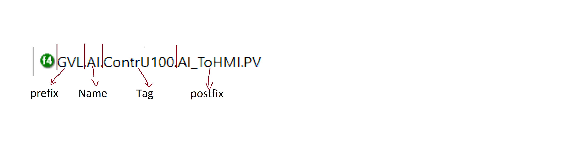

# генерация пользовательского дерева трендов по И\О листу
----
## Лайтовая инструкция
- Все Входные данные кидаем в папку Input - это i/o-лист(тест был на .xlsm ) и config.json
> Правила config.json
1. nameFileTable - Имя эксель файла 
2. prefix - начало пути OPC одинаковое для всех структур 
3. excel_settings - массив куда заливаются настройки по каждому отдельному листу 
   1. Name - Название структуры идущее после префикса (AI | AO и т.д.)
   2. ExcelSheet - имя страницы в экселе откуда брать данные 
   3. TreePath - имя папки отображаемой в трендах. Обязательно использовать двойной обратный слеш \\\ 
   4. Tag - указываем столбец из экселя откуда брать алгоритмическое имя (AlgName)
   5. Unit - указываем столбец из экселя откуда брать единицы измерения
   6. Description - указываем столбец из экселя откуда брать человеческое наименование сигнала 
   7. Postfix - Окончание пути OPC-тега до нужного атрибута (AI_ToHMI.PV | DO_ToHMI.PV и т.д.)
   8. StartCount - число обозначающее с какой строки начинаются данные в листе

4. При большой необходимости изменить входную\выходную папку,имя выходного файла - заходим в файл _publicConst

 

----
## Запуск

Импорт нужных либ в проект 
> pip install -r requirements.txt

----
## Задачи

- [x] Генерация файла Json
- [x] Чтение данных из экселя
- [x] Генерация дерева трендов 
- [x] Выгрузить файл с зависимостями 
- [x] Дописать README
