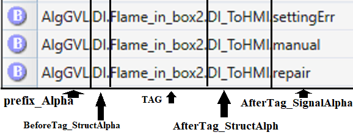
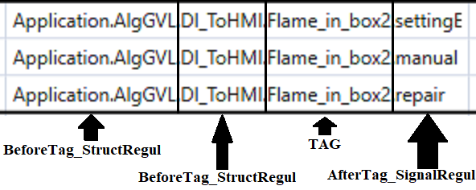
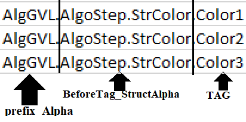
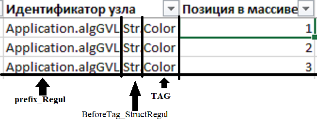

# Генерация пользовательского дерева трендов по И\О листу и OPC-карты 

## Лайтовая инструкция

### Общая Инфа
- Все Входные данные кидаем в папку Input это:
   - i/o-лист.xlsm 
   - Opc_Map.xlsx(Opc-карту)
   - config.json

- При большой необходимости изменить cледующие файлы  заходим в файл _publicConst.py:
   - входную \ выходную папку, 
   - имя выходного файла 
   - Имя файла конфигурации

> НО ЛУЧШЕ НЕ СТОИТ НИКУДА 

### Правила config.json

#### Генерация трендов
1. <b> nameFile_IO  </b> - Имя i\o-листа (эксель файла) с разрешением 
2. <b> prefix_Alpha </b> - начало пути OPC одинаковое для всех структур в альфе

3. <b>excel_settings</b>  - массив куда заливаются настройки по каждому отдельному листу для генерации трендов содержащий в себе:
   1. <b>Name</b>  - Название структуры идущее после префикса (AI | AO и т.д.)
   2. <b>ExcelSheet</b> - имя страницы в экселе откуда брать данные 
   3. <b>TreePath</b> - имя папки отображаемой в трендах. Обязательно использовать двойной обратный слеш \\\ 
   4. <b>Tag</b>- указываем столбец из экселя откуда брать алгоритмическое имя (AlgName)
   5. <b>Unit</b> - указываем столбец из экселя откуда брать единицы измерения
   6. <b>Description</b> - указываем столбец из экселя откуда брать человеческое наименование сигнала 
   7. <b>Postfix_Alpha</b> - Окончание пути OPC-тега до нужного атрибута (AI_ToHMI.PV | DO_ToHMI.PV и т.д.)
   8. <b>StartCount</b> - число обозначающее с какой строки начинаются данные в листе

 

#### Генерация opc карты

4. <b>nameFile_OpcMap</b> - Имя карты (эксель файла) с разрешением 
5. <b>binding_OpcMap</b> - общий тип привязки (обычно у всех "непосредственно" )
5. <b>addressSpace_OpcMap</b> - адресное пространство (обычно у всех "urn:ProsoftSystems:regul_ua_server:iec_data" )
7. <b>typeId_OpcMap</b> - тип индентификатора (обычно у всех "строковый" )
8. <b>prefix_Regul</b> - начало пути OPC одинаковое для всех структур в регуле
9. <b>shitty_wizard</b> - массив паттернов для структур (соответсвия альфы и регула) содержащий в себе:
   1. <b>BeforeTag_StructAlpha</b><i>(строка)</i>
   2. <b>AfterTag_StructAlpha</b><i>(строка)</i>
   3. <b>AfterTag_SignalAlpha</b><i>(Массив строк)</i>
   4. <b>BeforeTag_StructRegul</b><i>(строка)</i>
   5. <b>BeforeTag_SignalRegul</b><i>(Массив строк)</i>
   6. <b>AfterTag_SignalRegul</b><i>(Массив строк)</i>
   7. <b>IsArray</b><i>(bool) </i> - если стоит true тогда ищет в конце имени позицию перемнной в массиве и дополнительно заполняется поле "Позиция в массиве"

#### Примеры построения шаблонов 

   
   

---------

   
   

В данном примере еще указан флаг  <b>"IsArray" : true</b> что приводит к тому что в конце имени тега осуществляется поиск числа и заполняется дополнительный стобец

----
## Запуск программы

Импорт нужных либ в проект 
> pip install -r requirements.txt

Запустите скрипт, выполнив следующую команду:
> python main.py

----
## Задачи
В разработке:
- Нет задач  

Завершенные: 
- [x] Чтение данных из экселя 
- [x] Генерация дерева трендов  в формате json
- [x] Выгрузить файл с зависимостями 
- [x] Заполнение ОПС-карты в формате экселя
- [x] редактировать README
- [x] Сделать генерацию карты не столь колхозно 
